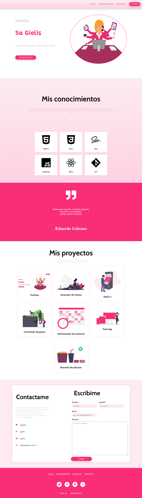

# Portafolio de Sa

### Este proyecto está realizado para mostrar un ejemplo 
de como seria el portafolio para la entrega final del módulo 01 de ADA.

<br>

***

### Si quieres ver como quedó, puedes darle clik a este [enlace](sjgielis.github.io/portfolio/.)
O puedes hacerlo desde [acá ]()

<br>

***

### Si quieres tener el código en tu computadora, deberás de seguir estos pasos en tu terminal.

- Ir al [repositorio] (https://github.com/sjgielis/portfolio)
- Darle click al botón de forkear
- Darle click al botón de code
- Copiar la url
- Abrir tu terminal y poner el comando de ```git clone <url>" ```
- Entrar a la carpeta del proyecto y abrirlo en tu IDE


### Este proyecto no necesita la instalación de ninguna dependencia, por ahora!

<br>
***

### Este debería ser el resultado final de tu instalación



<br>

***

### Este portafolio fue desarrollado para las chicas de la cursada 6 de ADA.
Agradezco a [Ledy] (https://www.linkedin.com/in/leydykmoreno/
), la ayuda proporcionada. 

<br>

***

#### De Sa Gielis  con  ❤ para ustedes!
